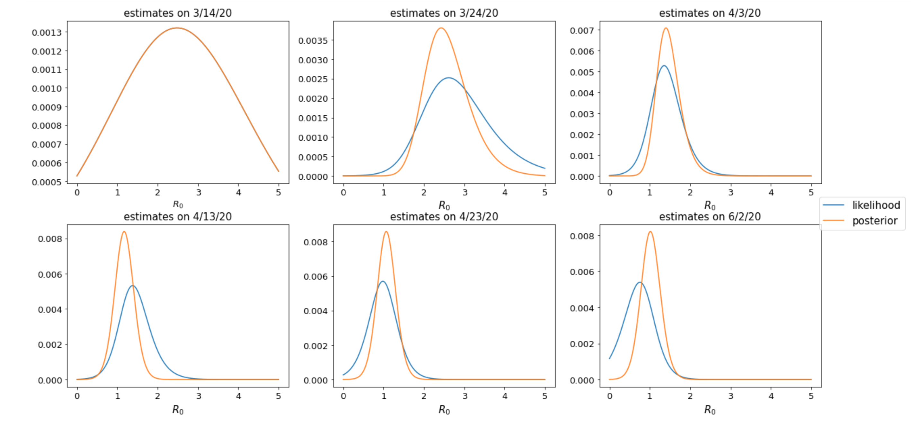
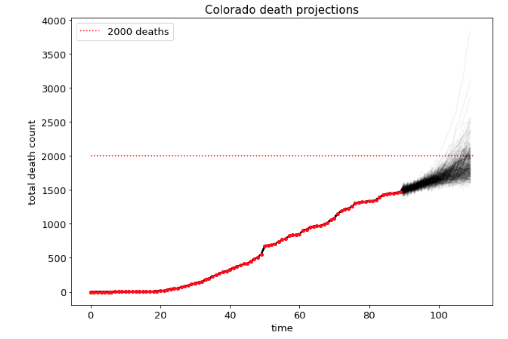

# Colorado Covid-19 projections using realtime update of R0

The main file here is `realtime_r0.ipynb`. In this notebook, we explore fitting a epidemiological model to predict the rate of spread of Covid-19 in Colorado. The rate of spread of Covid-19 is characterized by the reproductive rate  R0. Here, we try to estimate  R0 using the realtime  R0 model from  [Bettencourt, Ribeiro 2008](https://journals.plos.org/plosone/article?id=10.1371/journal.pone.0002185). This is Bayesian method that not only provides an estimate of R0 , but also provides us with a probability distribution over likley values of  R0. 

Carefully analyzing the uncertainty in predictions if R0 is essential to making accurate future predictions about the rate of spread of Covid-19. Please see  `realtime_r0.ipynb` for more details on the model. Feel free to make a PR if have ideas or suggestions to improve the model.

## Estimation of posteriors

## Projections for future deaths

